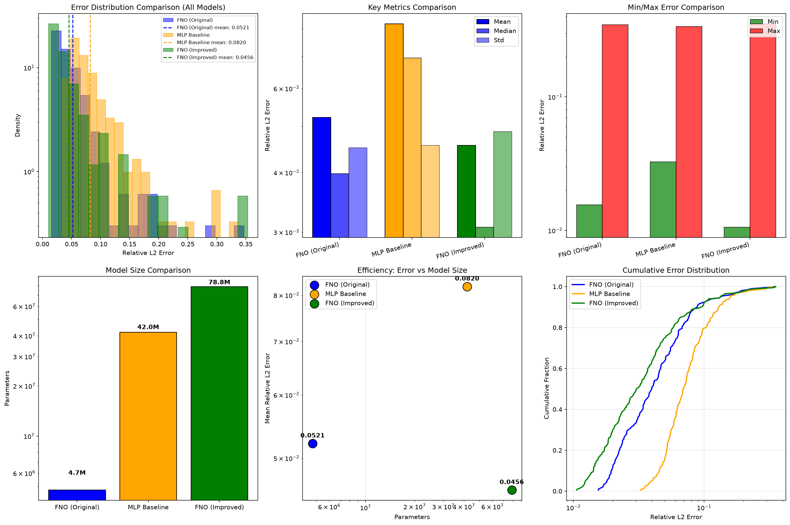
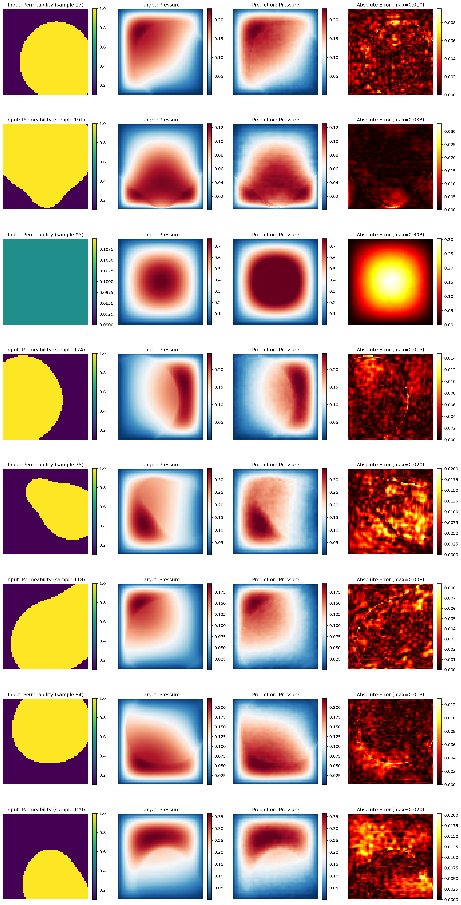

# AE646 Final Presentation: FNO for Parametric Darcy Flow

**Presenter:** Aryaman Srivastava

---

## Slide 1: Title
**Fourier Neural Operator for Parametric Darcy Flow**
AE646: Scientific Machine Learning for Fluid Mechanics
Aryaman Srivastava

---

## Slide 2: Problem & Motivation

**Parametric PDE challenge:**
- Darcy flow: -div(κ∇u) = f, κ piecewise-constant in {0.1, 1.0}
- Real PDEBench data: 1000 train/val, 200 test (of 10,000 total, seed=42 subset)
- Need a fast surrogate for optimization, UQ, inverse problems

**Why operator learning?**
- Traditional solvers: re-mesh + re-solve per parameter (slow — see Slide 8)
- FNO/DeepONet: learn G: κ → u once, evaluate in ~1 ms
- Zero-shot super-resolution: train at 64×64, test at PDEBench's real native 128×128

---

## Slide 3: Dataset & Baseline

**Real PDEBench 2D Darcy Flow (β=1.0)**
- Downloaded from the official source, verified by checksum against PDEBench's manifest
- 900 train / 100 val / 200 test, 64×64 (downsampled from native 128×128)
- Piecewise-constant permeability (κ ∈ {0.1, 1.0}) from a thresholded Gaussian random field

**Baseline: MLP (42.0M params)**
- Flatten 64×64×3 → 3×2048 hidden → flatten output
- **No spatial inductive bias**

---

## Slide 4: Fourier Neural Operator

**Architecture:**
```
Input (3 ch) → Lift → 4× SpectralConv + 1×1 Conv + LN + GELU → Project → Output (1 ch)
```

**Spectral convolution:**
- FFT → multiply learned weights in Fourier space → IFFT
- Keeps only low-frequency modes (modes=12)
- **4.7M parameters** (vs 42.0M for MLP)

---

## Slide 5: Results Summary

| Model | Test Mean Rel L2 | Parameters |
|-------|------------------|------------|
| **FNO (original)** | **0.0521** | **4.7M** |
| MLP baseline | 0.0820 | 42.0M |
| **FNO (improved)** | **0.0456** | 78.8M |

**FNO: 36% lower error than MLP, with 8.8× fewer parameters**

---

## Slide 6: Error Distributions



- FNO and MLP have similar error *spread* (std ≈ 0.045), but FNO's distribution sits at a
  lower mean/median
- Both models' worst cases come from the same kind of input (near-uniform permeability,
  Slide 9) — a genuinely hard case, not a model-specific failure

---

## Slide 7: Sample Predictions



**Columns:** Permeability input | Target pressure | FNO prediction | Absolute error

**Observations:**
- FNO captures the global pressure structure accurately for typical (sharp-boundary) inputs
- Error concentrates at sharp permeability interfaces (high-frequency content)
- Physics respected: low permeability → steeper local pressure gradient

---

## Slide 8: Zero-Shot Super-Resolution (real data, no retraining)

| Resolution | FNO (original) | FNO (improved) |
|------------|-----------------|------------------|
| 64×64 (train) | 0.0521 | 0.0456 |
| 128×128 (real PDEBench ground truth, zero-shot) | 0.0594 | 0.0563 |

**Both FNOs evaluate on unseen, native resolution without retraining.**
MLP cannot do this — fixed input dimension.

---

## Slide 9: A Genuine Failure Mode

Worst-case test samples (both models) have **near-uniform permeability** — little spatial
contrast for the model to exploit, producing a smooth radial pressure bump whose peak
amplitude is over-predicted. Consistent with the training distribution rarely producing
such low-contrast fields (correlation length 0.1 favors sharp blob structure).

---

## Slide 10: Real Inference-Speed Benchmark

| Method | Time/sample | Device |
|--------|-------------|--------|
| FNO (original) | 0.71 ms | CUDA |
| MLP | 0.13 ms | CUDA |
| FDM solver (scipy sparse) | 1030 ms | CPU |

- Both neural surrogates are **1000×+ faster** than solving the PDE numerically
- **Counter-intuitive but real:** MLP is *faster per sample* than FNO despite 9× more
  parameters — FFT overhead vs GPU-optimized dense matmuls, not a parameter-count story

---

## Slide 11: Key Findings

1. FNO beats MLP on accuracy with far fewer parameters — spectral inductive bias helps
2. Original FNO is the most parameter-efficient configuration; improved FNO trades 16.6×
   more parameters for a 12.6% error reduction
3. Zero-shot super-resolution genuinely works, verified against real PDEBench ground truth
4. Parameter count ≠ inference latency: measured speed tells a different story than params alone
5. The gap to commonly-cited FNO literature numbers (~0.01–0.02) traces to real dataset
   differences (piecewise-constant vs continuous permeability, sharper interfaces), not a
   metric-definition artifact — checked and ruled out

---

## Slide 12: Limitations & Future Work

**Limitations:**
- FFT implies periodic BC; the PDE itself uses Dirichlet boundaries
- Fixed modes cannot adapt to varying frequency content per-sample
- FNO's parameter efficiency doesn't automatically mean lower latency (Slide 10)

**Future work:**
- U-FNO / WNO architectures for sharper interfaces
- Physics-informed loss (PDE residual)
- Time-dependent / 3D extensions

---

## Slide 13: Reproducibility

**One-command reproduction:**
```bash
pip install -r requirements.txt
python src/download_data.py       # real PDEBench, checksum-verified
python src/preprocess.py
python src/train.py --config configs/fno.yaml
python src/evaluate.py --config configs/fno.yaml --checkpoint results/run_001/best_model.pt
python src/superres_eval.py --config configs/fno.yaml --checkpoint results/run_001/best_model.pt
python src/benchmark_speed.py
```

All configs, seeds, and metrics are versioned in this repo; results were independently
cross-checked across two machines (Apple Silicon and an NVIDIA GPU).

---

## Slide 14: Thank You

**Questions?**

Report: `FINAL_REPORT.md` · Results: `results/` · Code: `src/`
